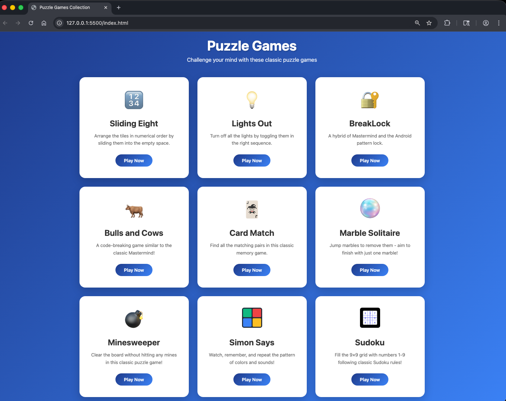
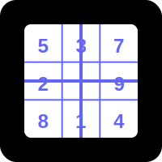

# Puzzle Games Collection

A collection of classic and modern puzzle games built with pure HTML, CSS, and JavaScript. All games run entirely in your browser with no backend required!

[Play Here](https://mikeanderson12.github.io/puzzle-games/)

## Games Included

### 1. **Sliding Eight Puzzle** 🔢
Arrange numbered tiles in order by sliding them into the empty space.
- Classic 3×3 grid puzzle
- Move counter and timer
- Shuffle feature for new challenges

### 2. **Lights Out** 💡
Turn off all the lights by toggling them in the right sequence.
- 5×5 grid of lights
- Each toggle affects adjacent lights
- Multiple difficulty levels

### 3. **BreakLock** 🔐
A hybrid of Mastermind and the Android pattern lock.
- Draw patterns to crack the code
- Visual feedback on correct positions
- Progressive difficulty

### 4. **Bulls and Cows** 🐂
A code-breaking game similar to the classic Mastermind!
- Guess the 4-digit secret code
- Bulls = correct digit in correct position
- Cows = correct digit in wrong position

### 5. **Card Match** 🃏
Find all the matching pairs in this classic memory game.
- Multiple difficulty levels
- Timer and move counter
- Beautiful card designs

### 6. **Marble Solitaire** 
Jump marbles to remove them - aim to finish with just one marble!
- Classic cross-shaped board
- Strategic jumping mechanics
- Score tracking

### 7. **Minesweeper** 💣
Clear the board without hitting any mines in this classic puzzle game!
- Multiple difficulty levels
- Flag system for marking mines
- First-click safety guarantee

### 8. **Simon Says** 
Watch, remember, and repeat the pattern of colors and sounds!
- Progressive difficulty with each level
- Audio and visual feedback
- High score tracking

### 9. **Sudoku** 
Fill the 9×9 grid with numbers 1-9 following classic Sudoku rules!
- Three difficulty levels (Easy, Medium, Hard)
- Hint system
- Error checking and validation

----

## Getting Started

1. **Open the collection**: Open `index.html` in your web browser
2. **Choose a game**: Click on any game card to start playing
3. **Play**: Each game has its own instructions accessible via the "How to Play" button

### Features
- ✅ **No installation required** - runs directly in the browser
- ✅ **No backend needed** - all games are client-side
- ✅ **Responsive design** - works on desktop and mobile
- ✅ **Local storage** - saves high scores and preferences
- ✅ **Modern UI** - clean, colorful, and intuitive interfaces
- ✅ **Accessibility** - keyboard support where applicable

### Browser Compatibility
Works in all modern browsers:
- Chrome/Edge (recommended)
- Firefox
- Safari
- Opera

## Design Philosophy

- **Minimalist UI**: Clean interfaces that focus on gameplay
- **Consistent Experience**: Similar controls and layouts across all games
- **Visual Feedback**: Clear indicators for user actions and game states
- **Accessibility**: Keyboard support and clear visual cues

## How It Works

All games are **client-side applications** that run entirely in your browser:

1. **No servers**: Everything runs locally in your browser
2. **No processes**: Games only run when the page is open
3. **Local storage only**: High scores and preferences are saved in browser storage
4. **Closing the browser stops everything**: No background processes continue

### Data Storage
- High scores are saved using browser `localStorage`
- No personal data is collected or transmitted
- Data persists between sessions but stays on your device

## Controls

Each game has its own control scheme, but common patterns include:
- **Mouse/Touch**: Click or tap to interact
- **Keyboard**: Number keys, arrow keys, or specific shortcuts
- **Buttons**: On-screen controls for all actions

## Individual Game Documentation

Each game has its own detailed README with:
- Complete rules and objectives
- Control instructions
- Strategy tips
- Technical implementation details

Check each game's folder for its specific README.

## Acknowledgments

This repository was built by me with assistance from AI coding tools for planning, implementation support, and documentation refinement.

## Disclaimer

This is an independent educational and portfolio project. It is not affiliated with, endorsed by, or sponsored by any third-party.