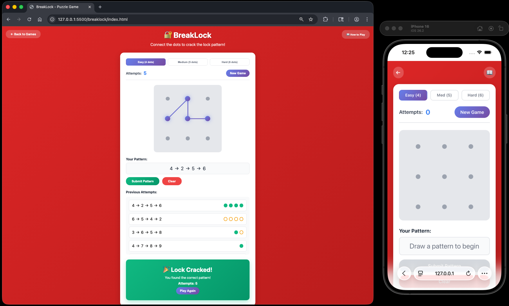

# BreakLock Puzzle

A fun and interactive lock pattern puzzle game built with vanilla HTML, CSS, and JavaScript. Crack the secret pattern using logic and deduction - a hybrid of Mastermind and Android lock patterns!

Enjoy the puzzle! 🔐


## How to Play

### Objective
Find the secret lock pattern by connecting dots in the correct order. Use feedback from each attempt to deduce the correct sequence.

### Rules
1. The puzzle consists of a 3×3 grid with 9 dots numbered 1-9
2. Connect dots by clicking and dragging to create a pattern
3. The pattern length depends on difficulty:
   - **Easy**: 4 dots
   - **Medium**: 5 dots
   - **Hard**: 6 dots
4. Each dot can only be used once per pattern
5. Submit your pattern to receive feedback
6. Use the feedback to narrow down the correct pattern

### Feedback System
After each attempt, you'll receive feedback using two symbols:

- **●** (filled circle) = A dot is correct AND in the right position
- **○** (hollow circle) = A dot is in the pattern but in the wrong position

### Tips
- Start by trying different combinations to gather information
- Pay close attention to which dots appear in the feedback
- Use process of elimination based on the feedback
- The number of feedback symbols tells you how many dots you got right
- Try to solve it in as few attempts as possible!


## How to Start

### Option 1: Open Directly in Browser
1. Navigate to the project folder
2. Double-click `index.html` or right-click and select "Open with" your preferred browser

### Option 2: From Terminal/Command Line
```bash
# Navigate to the project directory
cd /path/to/breaklock

# macOS
open index.html

# Windows
start index.html
```


## Project Structure

```
breaklock/
├── index.html      # Main HTML structure
├── styles.css      # Styling and animations
├── game.js         # Game logic and functionality
└── README.md       # This file
```

## Features

- **Three Difficulty Levels**: Choose between Easy (4 dots), Medium (5 dots), or Hard (6 dots)
- **Interactive Drawing**: Click and drag to draw patterns naturally like an Android lock screen
- **Mastermind Feedback**: Get precise feedback on each attempt to help you deduce the pattern
- **Attempt Tracking**: See all your previous attempts and their feedback
- **Visual Pattern Display**: Canvas-based line drawing shows your pattern as you create it
- **Responsive Design**: Works on desktop and mobile devices with touch support
- **Modern UI**: Beautiful gradient design with smooth animations

## Technical Details

- **No Dependencies**: Built with pure HTML, CSS, and JavaScript
- **Canvas API**: Uses HTML5 Canvas for smooth pattern line drawing
- **Touch Support**: Works with both mouse and touch input
- **No Build Process**: Just open and play
- **Browser Compatibility**: Works in all modern browsers (Chrome, Firefox, Safari, Edge)

## Game Strategy

BreakLock combines logic puzzle elements from Mastermind with the familiar Android lock pattern interface. Here are some strategies:

- **Information Gathering**: Your first few attempts should focus on discovering which dots are in the pattern
- **Position Testing**: Once you know which dots are included, test different orderings
- **Elimination**: Keep track of what you've tried to avoid repeating failed patterns
- **Feedback Analysis**: If you get all hollow circles, you have the right dots but wrong order
- **Systematic Approach**: Try changing one dot at a time to isolate which positions are correct
- **Practice**: Pattern recognition improves with experience!


## Example


