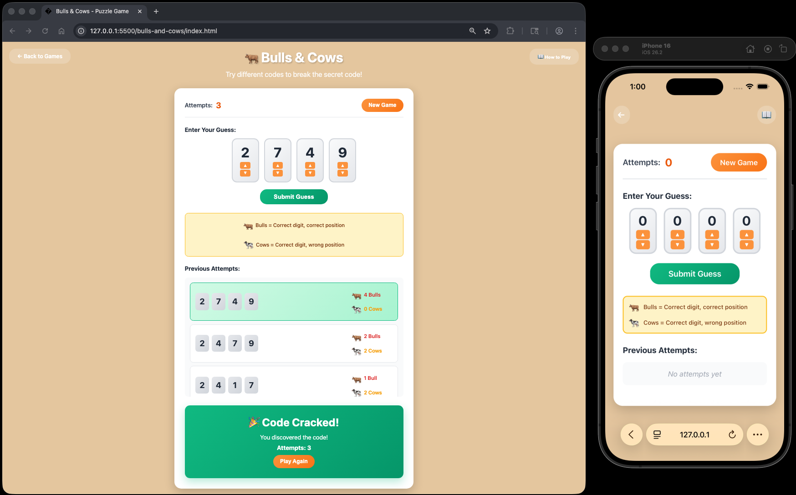

# Bulls & Cows Puzzle

A fun and interactive code-breaking puzzle game built with vanilla HTML, CSS, and JavaScript. Discover the hidden 4-digit code using logic and deduction!

Enjoy the puzzle! 🐂


## How to Play

### Objective
Guess the secret 4-digit code where each digit is between 0-9. Use feedback from each guess to deduce the correct code.

### Rules
1. The game generates a random 4-digit code (digits 0-9)
2. Each digit in the code can be any number from 0 to 9
3. Digits can repeat in the code
4. Enter your guess using the digit boxes
5. Submit your guess to receive feedback
6. Use the feedback to narrow down the correct code

### Feedback System
After each guess, you'll receive feedback in the form of Bulls & Cows:

- **Bulls (🐂)** = Number of digits that are correct AND in the correct position
- **Cows (🐄)** = Number of digits that are correct but in the WRONG position

### Controls
- **Click ▲/▼ buttons**: Increment or decrement digits
- **Arrow Keys**: Use ↑/↓ to change digit values when a box is focused
- **Number Keys**: Type 0-9 to directly set a digit value
- **Tab Key**: Move between digit boxes
- **Enter Key**: Submit your guess

### Tips
- Start with a diverse guess to gather information
- Pay attention to which digits appear in the feedback
- If you get cows but no bulls, you have the right digits in wrong positions
- If you get bulls, those positions are locked in - focus on the remaining positions
- Try to solve it in as few attempts as possible!


## How to Start

### Option 1: Open Directly in Browser
1. Navigate to the project folder
2. Double-click `index.html` or right-click and select "Open with" your preferred browser

### Option 2: From Terminal/Command Line
```bash
# Navigate to the project directory
cd /path/to/bulls-and-cows

# macOS
open index.html

# Windows
start index.html
```


## Project Structure

```
bulls-and-cows/
├── index.html      # Main HTML structure
├── styles.css      # Styling and animations
├── game.js         # Game logic and functionality
└── README.md       # This file
```

## Features

- **Interactive Digit Input**: Click buttons or use keyboard controls to change digits
- **Multiple Input Methods**: Mouse clicks, arrow keys, and direct number input
- **Bulls & Cows Feedback**: Clear visual feedback after each guess
- **Attempt Tracking**: See all your previous guesses and their feedback
- **Keyboard Navigation**: Full keyboard support with Tab and arrow keys
- **Responsive Design**: Works on desktop and mobile devices
- **Modern UI**: Beautiful gradient design with smooth animations
- **Visual Feedback Legend**: Always visible reminder of what Bulls & Cows mean

## Technical Details

- **No Dependencies**: Built with pure HTML, CSS, and JavaScript
- **No Build Process**: Just open and play
- **Browser Compatibility**: Works in all modern browsers (Chrome, Firefox, Safari, Edge)
- **Keyboard Accessible**: Full keyboard navigation and control support

## Game Strategy

Bulls & Cows is a classic code-breaking game that predates Mastermind. Here are some strategies:

- **Information Gathering**: Your first guess should use diverse digits to learn which numbers are in the code
- **Position Testing**: Once you know which digits are present, test different positions
- **Elimination**: Keep track of digits that don't appear in the feedback
- **Bulls First**: If you get bulls, those positions are confirmed - focus on the remaining positions
- **Cow Analysis**: If you have cows, try swapping those digits to different positions
- **Systematic Approach**: Change one digit at a time to isolate which changes improve your score
- **Pattern Recognition**: Look for patterns in your feedback to make logical deductions

### Example Game
```
Secret Code: 5 2 7 1

Guess 1: 1 2 3 4  →  1 Bull, 1 Cow  (2 is correct position, 1 is wrong position)
Guess 2: 5 2 6 7  →  2 Bulls, 1 Cow  (5 and 2 correct, 7 wrong position)
Guess 3: 5 2 7 0  →  3 Bulls, 0 Cows (5, 2, 7 correct, need to find last digit)
Guess 4: 5 2 7 1  →  4 Bulls, 0 Cows (Code cracked!)
```


## Example


