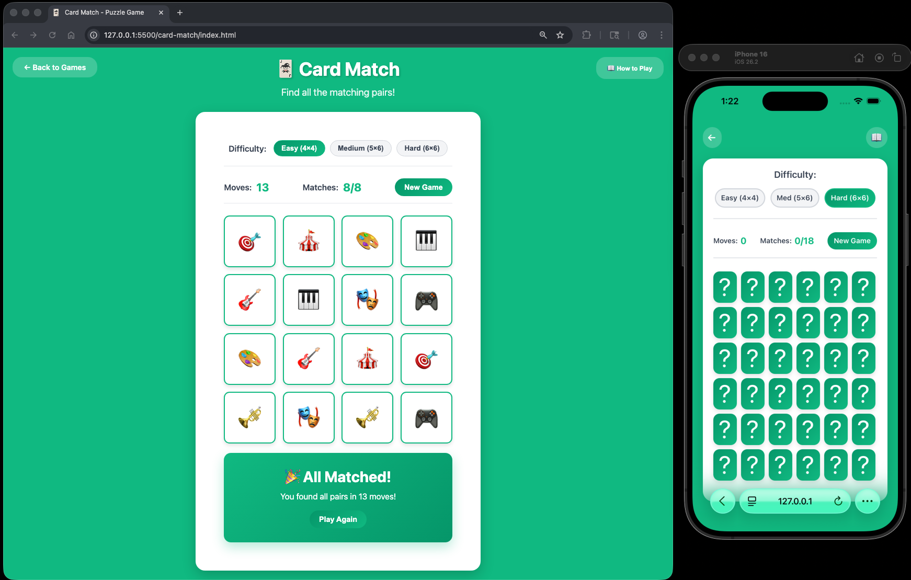

# Card Match Puzzle

A fun and interactive memory card matching game built with vanilla HTML, CSS, and JavaScript. Test your memory by finding all the matching pairs!

Enjoy the puzzle! 🃏


## How to Play

### Objective
Find all 8 matching pairs of cards by flipping them over two at a time.

### Rules
1. The game consists of a 4×4 grid with 16 cards (8 pairs)
2. All cards start face down
3. Click on a card to flip it over and reveal its symbol
4. Click on a second card to try to find its match
5. If the two cards match, they stay face up
6. If they don't match, both cards flip back over after a brief delay
7. Continue until all pairs are found

### Tips
- Try to memorize the positions of cards as you flip them
- Start by flipping cards in different areas to get a good overview
- Your move count is tracked - try to complete the game in as few moves as possible!
- Click "New Game" to shuffle and start over


## How to Start

### Option 1: Open Directly in Browser
1. Navigate to the project folder
2. Double-click `index.html` or right-click and select "Open with" your preferred browser

### Option 2: From Terminal/Command Line
```bash
# Navigate to the project directory
cd /path/to/card-match

# macOS
open index.html

# Windows
start index.html
```


## Project Structure

```
card-match/
├── index.html      # Main HTML structure
├── styles.css      # Styling and animations
├── game.js         # Game logic and functionality
└── README.md       # This file
```

## Features

- **4×4 Grid**: 16 cards with 8 matching pairs
- **Smooth Flip Animation**: 3D card flip effect using CSS transforms
- **Move Counter**: Tracks the number of moves you make
- **Match Counter**: Shows how many pairs you've found
- **Auto Shuffle**: Cards are randomly shuffled at the start of each game
- **Match Detection**: Automatically detects when cards match
- **Win Detection**: Celebrates when all pairs are found
- **Responsive Design**: Works on desktop and mobile devices
- **Modern UI**: Beautiful green gradient design with smooth animations
- **Collapsible Instructions**: Clean interface with expandable how-to-play section

## Technical Details

- **No Dependencies**: Built with pure HTML, CSS, and JavaScript
- **CSS 3D Transforms**: Card flip animations using perspective and rotateY
- **No Build Process**: Just open and play
- **Browser Compatibility**: Works in all modern browsers (Chrome, Firefox, Safari, Edge)

## Game Strategy

Card Match is a classic memory game that tests your concentration and recall. Here are some strategies:

- **Systematic Approach**: Flip cards in a methodical pattern (e.g., row by row) to build a mental map
- **Focus on Pairs**: When you see a card, actively try to remember if you've seen its match
- **Visual Memory**: Associate card positions with visual landmarks on the grid
- **Minimize Moves**: Try to remember as many positions as possible before making matches
- **Practice**: Your memory will improve the more you play!


## Example


