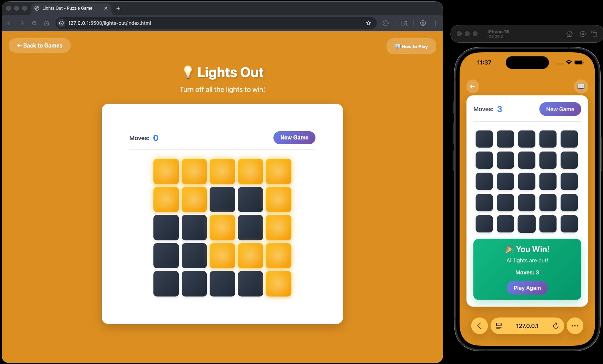

# Lights Out Puzzle

A fun and interactive 5×5 lights puzzle game built with vanilla HTML, CSS, and JavaScript. Test your problem-solving skills by turning off all the lights!

Enjoy the puzzle! 💡


## How to Play

### Objective
Turn off all 25 lights on the 5×5 grid to win the game.

### Rules
1. The puzzle consists of a 5×5 grid with 25 lights that can be either ON (glowing yellow) or OFF (dark)
2. Click any light to toggle it and its **adjacent neighbors** (up, down, left, right)
3. Diagonal lights are NOT affected - only the four directly adjacent lights
4. The clicked light and its neighbors will switch states (ON becomes OFF, OFF becomes ON)
5. Continue clicking lights until all lights are turned off

### Tips
- Each click affects up to 5 lights (the clicked light plus up to 4 neighbors)
- Lights on the edges and corners affect fewer neighbors
- Your move count is tracked - try to solve it in as few moves as possible!
- Click "New Game" to start a fresh puzzle with a new configuration


## How to Start

### Option 1: Open Directly in Browser
1. Navigate to the project folder
2. Double-click `index.html` or right-click and select "Open with" your preferred browser

### Option 2: From Terminal/Command Line
```bash
# Navigate to the project directory
cd /path/to/lights-out

# macOS
open index.html

# Windows
start index.html
```


## 📁 Project Structure

```
lights-out/
├── index.html      # Main HTML structure
├── styles.css      # Styling and animations
├── game.js         # Game logic and functionality
└── README.md       # This file
```

## Features

- **Responsive Design**: Works on desktop and mobile devices
- **Move Counter**: Tracks the number of moves you make
- **Randomized Puzzles**: Each game starts with a unique, solvable configuration
- **Win Detection**: Automatically detects when you've turned off all the lights
- **Modern UI**: Beautiful gradient design with smooth animations and glowing effects
- **Visual Feedback**: Lights pulse when toggled for satisfying interaction

## Technical Details

- **No Dependencies**: Built with pure HTML, CSS, and JavaScript
- **No Build Process**: Just open and play
- **Browser Compatibility**: Works in all modern browsers (Chrome, Firefox, Safari, Edge)

## Game Strategy

Lights Out is a classic puzzle with interesting mathematical properties. Here are some strategies:

- **Corner Strategy**: Start by working on corner lights, as they have fewer neighbors
- **Pattern Recognition**: Look for patterns and symmetries in the light configuration
- **Chase the Lights**: A common strategy is to work row by row from top to bottom
- **Light Chasing Algorithm**: Toggle lights in the row below any lit lights in the current row
- **Practice**: Some configurations require specific sequences - the more you play, the better you'll get!


## Example


