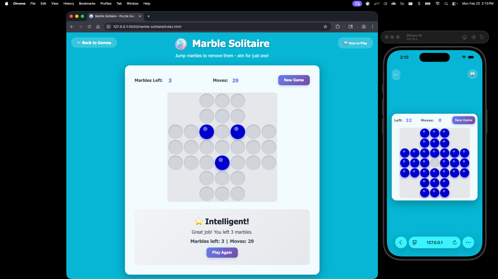

# 🔵 Marble Solitaire

A classic Marble Solitaire puzzle game with a cross-shaped board. Jump marbles to remove them and aim to finish with just one marble remaining!

## How to Play

### Objective
Remove marbles by jumping over them until only one marble remains on the board!

### Controls
- **Click a marble**: Select it (highlighted in gold)
- **Click a hole**: Move the selected marble to that position (if valid)
- Valid moves are highlighted in green

### Game Rules
1. You can only move a marble by jumping over an adjacent marble into an empty hole
2. The jumped marble is removed from the board
3. Only horizontal and vertical moves are allowed - no diagonals!
4. You must jump over exactly one marble per move
5. The game ends when no more valid moves are available

### Board Layout
- **Cross-shaped board**: 7×7 grid with 33 positions
- **Starting position**: 32 marbles with the center hole empty
- **Goal**: End with just 1 marble remaining

## Features

- **Move Counter**: Track how many moves you've made
- **Marble Counter**: Shows how many marbles remain on the board
- **Visual Feedback**: Selected marbles pulse in gold, valid moves glow in green
- **Smart Move Detection**: Automatically detects when no more moves are possible
- **Performance Scoring**: Get rated based on how many marbles you finish with
- **Responsive Design**: Works on desktop and mobile devices

## Scoring System

Your performance is rated based on marbles remaining:
- **1 marble**: 🏆 You're a Genius! - Perfect game!
- **2 marbles**: 🌟 Very Intelligent! - Excellent work!
- **3 marbles**: ⭐ Intelligent! - Great job!
- **4+ marbles**: 💪 More Practice! - Keep trying!

## Tips & Strategy

1. **Plan ahead** - Think several moves in advance before committing
2. **Work from the outside in** - Start by clearing outer marbles first
3. **Keep the center accessible** - Try to maintain access to the center position
4. **Avoid isolating marbles** - Don't leave marbles with no possible jumps
5. **Practice patterns** - Learn common opening sequences that work well
6. **Be patient** - This is a challenging puzzle that requires careful planning

## Technical Details

- **Pure JavaScript**: No frameworks or dependencies
- **Responsive Grid**: Adapts to different screen sizes
- **Modern CSS**: Gradient backgrounds and smooth animations
- **Modal Instructions**: Clean overlay for game rules

## Game Mechanics

### Valid Moves
A move is valid when:
- You select a marble
- You click on an empty hole that is exactly 2 spaces away (horizontally or vertically)
- There is a marble in the space between the selected marble and the target hole
- The move is not diagonal

### Move Execution
When you make a valid move:
1. The selected marble moves to the target hole
2. The marble that was jumped over is removed
3. The original position becomes an empty hole
4. Marble count decreases by 1
5. Move count increases by 1

### Game Over
The game automatically ends when:
- No marbles have any valid moves available
- You are shown your final score based on marbles remaining

## Example

