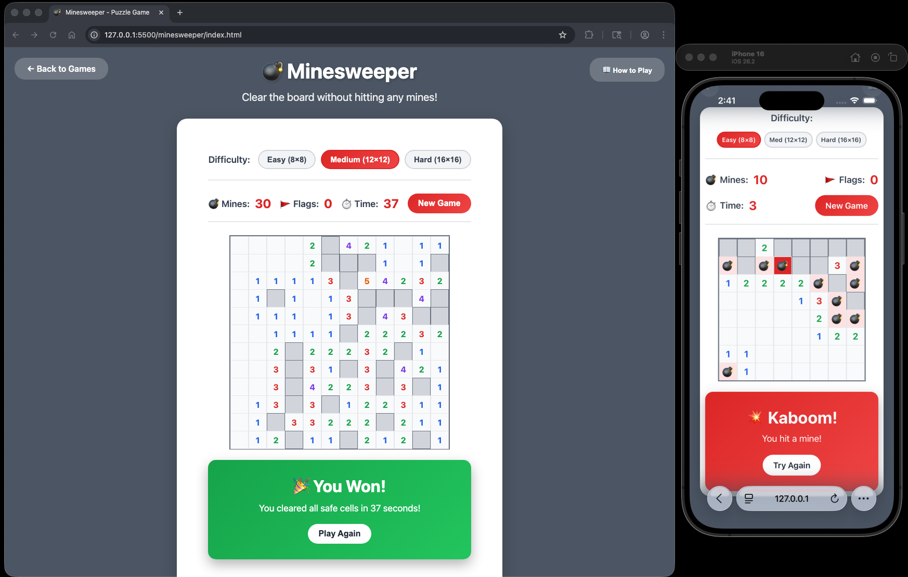

# 💣 Minesweeper

A classic Minesweeper puzzle game with multiple difficulty levels and a clean, modern interface.

## How to Play

### Objective
Clear the entire board without detonating any mines!

### Controls
- **Left Click**: Reveal a cell
- **Right Click**: Place or remove a flag to mark suspected mines
- **First Click**: Always safe - mines are placed after your first move

### Game Rules
1. Numbers indicate how many mines are adjacent to that cell (including diagonals)
2. Use the numbers to deduce where mines are located
3. Flag all mines and reveal all safe cells to win
4. Clicking on a mine ends the game

### Difficulty Levels
- **Easy (8×8)**: 10 mines - Perfect for beginners
- **Medium (12×12)**: 30 mines - A good challenge
- **Hard (16×16)**: 60 mines - For expert players

## Features

- **Three Difficulty Levels**: Choose from Easy, Medium, or Hard
- **Timer**: Track how fast you can solve the puzzle
- **Mine Counter**: Shows total number of mines
- **Flag Counter**: Track how many flags you've placed
- **Smart First Click**: The first cell you click is always safe, with mines placed avoiding that area
- **Recursive Reveal**: Clicking an empty cell automatically reveals adjacent empty cells
- **Win/Lose Detection**: Clear feedback when you win or hit a mine
- **Responsive Design**: Works on desktop and mobile devices

## Color Coding

Numbers are color-coded for easy identification:
- **1**: Blue
- **2**: Green
- **3**: Red
- **4**: Dark Blue
- **5**: Dark Red
- **6**: Cyan
- **7**: Black
- **8**: Gray

## Tips & Strategy

1. **Start with corners and edges** - They have fewer adjacent cells to check
2. **Look for patterns** - Common patterns can help you deduce mine locations quickly
3. **Use flags wisely** - Mark confirmed mines to avoid accidental clicks
4. **Count carefully** - Double-check your counts before making risky moves
5. **Work systematically** - Clear one section at a time rather than jumping around

## Technical Details

- **Pure JavaScript**: No frameworks or dependencies
- **Responsive Grid**: Adapts to different screen sizes
- **Modern CSS**: Gradient backgrounds and smooth animations
- **Modal Instructions**: Clean overlay for game rules

## Game Mechanics

### Mine Placement
- Mines are randomly placed after the first click
- First clicked cell and its adjacent cells are guaranteed safe
- Ensures every game is solvable from the start

### Cell States
- **Unrevealed**: Gray cells that haven't been clicked
- **Revealed**: White cells showing numbers or empty
- **Flagged**: Marked with 🚩 flag emoji
- **Mine**: Shows 💣 when revealed (game over)
- **Exploded**: Red background when you hit a mine

### Win Condition
The game is won when:
- All non-mine cells are revealed, OR
- All mines are correctly flagged

## Example

