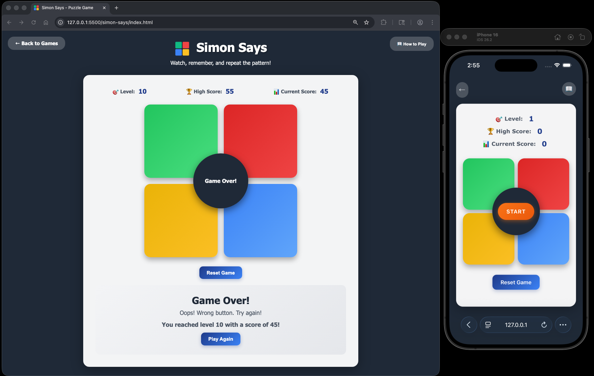

#  Simon Says

A classic memory game where you watch and repeat increasingly complex sequences of colors and sounds. Test your memory and concentration skills!

## How to Play

### Objective
Watch the sequence of colored buttons light up and repeat the pattern correctly to advance through levels!

### Controls
- **Click START**: Begin a new game
- **Click colored buttons**: Repeat the sequence shown by Simon
- Watch and listen carefully to the pattern

### Game Rules
1. Click the START button to begin the game
2. Simon will light up a sequence of colored buttons with corresponding sounds
3. After the sequence finishes, repeat it by clicking the buttons in the same order
4. Each level adds one more color to the sequence
5. The game ends if you click the wrong button
6. Try to beat your high score!

## Features

- **Progressive Difficulty**: Each level adds one more step to the sequence
- **Audio Feedback**: Each button plays a unique musical tone
- **Visual Feedback**: Buttons light up when activated
- **Score Tracking**: Earn points for each correct button press
- **High Score**: Your best score is saved locally
- **Level Counter**: Track your current level
- **Responsive Design**: Works on desktop and mobile devices

## Scoring System

- **1 point** per correct button press
- Complete a level to advance and face a longer sequence
- Your high score is automatically saved in your browser

## Tips & Strategy

1. **Focus on both visual and audio cues** - The combination helps with memory
2. **Create a rhythm or melody** - Think of the sequence as a song
3. **Use chunking** - Break longer sequences into smaller groups
4. **Stay relaxed** - Tension makes it harder to remember
5. **Take your time** - There's no rush when repeating the sequence
6. **Practice regularly** - Your memory will improve with practice

## Technical Details

- **Pure JavaScript**: No frameworks or dependencies
- **Web Audio API**: Generates musical tones for each button
- **Local Storage**: Saves your high score between sessions
- **Modern CSS**: Gradient backgrounds and smooth animations
- **Modal Instructions**: Clean overlay for game rules

## Game Mechanics

### Sequence Generation
- Each level adds one random color to the sequence
- Colors are chosen randomly from the four available buttons
- The sequence grows by one step each time you complete a level

### Visual Feedback
- Buttons light up when activated (brighter gradient)
- Glow effect appears around active buttons
- Disabled state when it's not the player's turn
- Center circle displays game status messages

### Game States
1. **Ready**: Game is ready to start, START button visible
2. **Playing Sequence**: Simon shows the pattern, buttons disabled
3. **Player Turn**: Player repeats the pattern, buttons enabled
4. **Level Complete**: Brief pause before next level
5. **Game Over**: Wrong button pressed, final score displayed

## Example

