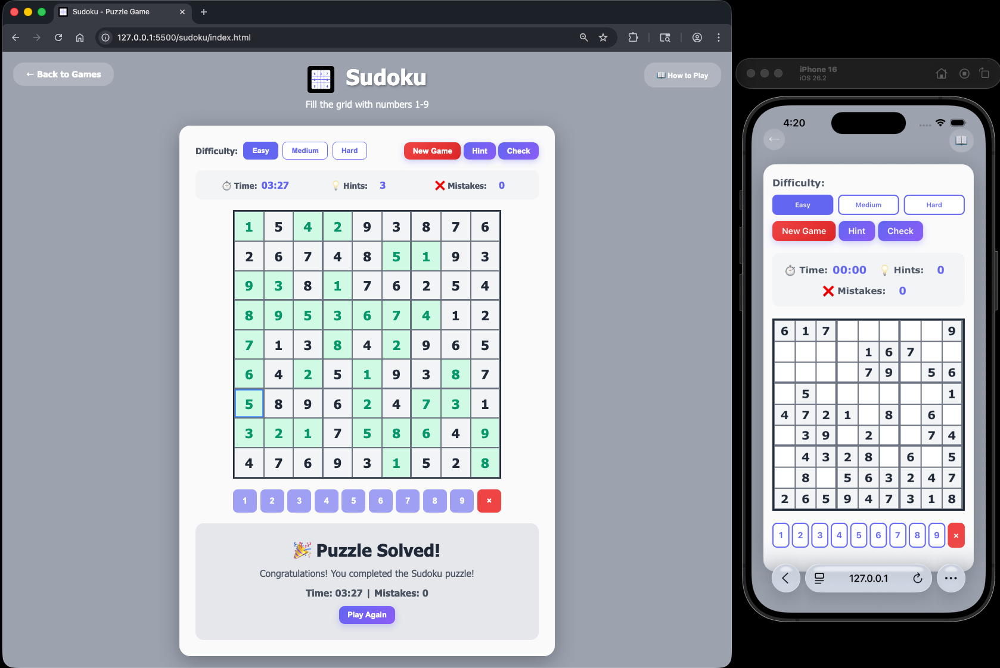

#  Sudoku

A classic Sudoku puzzle game with three difficulty levels. Fill the 9×9 grid with numbers 1-9 following the traditional Sudoku rules!

## How to Play

### Objective
Fill the entire 9×9 grid with numbers 1-9 so that each row, column, and 3×3 box contains all digits from 1 to 9 without repetition.

### Controls
- **Click a cell**: Select an empty cell to fill
- **Click number pad**: Enter a number 1-9 into the selected cell
- **Click "Erase"**: Clear the selected cell
- **Keyboard 1-9**: Quickly enter numbers
- **Delete/Backspace**: Erase the selected cell

### Game Rules
1. Each row must contain the numbers 1-9 without repetition
2. Each column must contain the numbers 1-9 without repetition
3. Each 3×3 box must contain the numbers 1-9 without repetition
4. Given numbers (shown in bold with gray background) cannot be changed
5. The puzzle is solved when all cells are correctly filled

### Difficulty Levels
- **Easy**: 35 cells removed - Great for beginners
- **Medium**: 45 cells removed - A good challenge
- **Hard**: 55 cells removed - For experienced players

## Features

- **Three Difficulty Levels**: Choose from Easy, Medium, or Hard
- **Timer**: Track how long it takes to solve the puzzle
- **Hint System**: Get up to 3 hints to reveal correct numbers
- **Check Solution**: Validate your current progress
- **Mistake Counter**: Track how many errors you've made
- **Visual Feedback**: Cells are color-coded (correct in green, errors in red)
- **Number Pad**: On-screen buttons for easy number entry
- **Keyboard Support**: Use number keys for quick input
- **Responsive Design**: Works on desktop and mobile devices

## Tips & Strategy

1. **Start with easy rows/columns** - Look for rows, columns, or boxes that already have many numbers filled
2. **Use pencil marks mentally** - Keep track of possible numbers for each cell
3. **Look for singles** - Find cells where only one number is possible
4. **Check boxes first** - The 3×3 boxes often provide the easiest clues
5. **Use the process of elimination** - Rule out numbers that can't go in certain cells
6. **Don't guess** - Use logic to deduce the correct numbers
7. **Use hints wisely** - Save hints for when you're truly stuck

## Technical Details

- **Pure JavaScript**: No frameworks or dependencies
- **Puzzle Generation**: Creates valid, solvable Sudoku puzzles
- **Backtracking Algorithm**: Ensures unique solutions
- **Modern CSS**: Gradient backgrounds and smooth animations
- **Modal Instructions**: Clean overlay for game rules

## Game Mechanics

### Puzzle Generation
- Generates a complete valid Sudoku solution using backtracking
- Removes cells based on difficulty level
- Ensures the puzzle has a unique solution
- Given cells are randomly distributed across the grid

### Validation
- Real-time error detection when placing numbers
- Check button validates the entire current solution
- Incorrect cells are highlighted in red
- Correct cells are highlighted in green

### Hint System
- Reveals one correct number in a random empty cell
- Limited to 3 hints per game
- Hint cells are highlighted in yellow
- Automatically checks for puzzle completion after hint

### Visual Indicators
- **Gray background**: Given numbers (cannot be changed)
- **Green background**: Correctly placed numbers
- **Red background**: Incorrectly placed numbers
- **Yellow background**: Numbers revealed by hints
- **Blue highlight**: Currently selected cell

## Example

